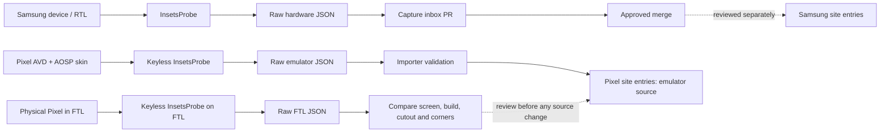

[Featured in Android Weekly #747](https://androidweekly.net/issues/issue-747)
# windowinsets.info

Window insets, display cutouts, corner radii and foldable hinge states for Samsung Galaxy and Google Pixel devices. The site shows where its measurements came from.

Its interface is inspired by [safearea.info](https://safearea.info), adapted for Android data and foldables.

## Why this exists

Apps targeting Android 15 (SDK 35) draw edge to edge by default, and apps targeting Android 16 (SDK 36) can no longer opt out. Every app now has to handle insets itself, but few teams own enough devices to see what those insets actually are.

**Check how your layout meets the system UI on devices you don't own, before you ship.**

| Problem | What this site gives you |
| --- | --- |
| A bug report says a button is hidden on a device you don't have, such as a Flip cover screen. | Pick the device, screen, rotation and navigation mode, and see the recorded insets and cutout. No device purchase or Remote Test Lab session needed. |
| Landscape was tested in one direction only. | Rotation 1 and rotation 3 are separate captures, so you can see which side the camera cutout lands on. |
| QA covers gesture navigation but not three-button navigation. | Each screen is captured in both navigation modes. |
| A Samsung skin in the emulator looks right, but it only changes the frame, not One UI's bars, cutout or corners. | Samsung values come from real devices or Samsung RTL. Pixel values are clearly labelled as emulator evidence. |
| Designers need safe margins for foldable cover and inner displays. | Cover and inner displays each have their own insets, corner radii and cutout bounds, in dp and px. |

### Common objections

**"Can't I just read insets at runtime?"** Yes, and your code should. The API tells your app what it receives on the device it is running on. It cannot tell you, before release, what it will receive on devices you never tested. Use this site for design, test planning and reproducing reports, not as a replacement for the API.

**"If insets are handled correctly, why do the numbers matter?"** Your code may not need them. The people you build with often do: designers and frontend developers find safe areas and insets hard to picture from a description. A diagram of a real device, with its status bar, navigation bar, cutout and corners in place, gives everyone the same picture to point at.

**"Can't an AI answer this?"** An AI can explain `WindowInsets` and write the handling code. It cannot reliably tell you the navigation bar inset on a specific Galaxy cover screen in rotation 3 with three-button navigation. Nobody publishes that number; it has to be measured, and a model asked for it will give a plausible guess. Every value here links to a raw capture you can check, and missing values stay **pending** instead of being guessed. AI tools can use the [JSON export](docs/JSON_EXPORT.md) as ground truth too.

**"Why not use Remote Test Lab or buy the devices?"** Each RTL session costs credits and minutes per device, screen, rotation and navigation mode. This project has done that work once and published the results for everyone.

## Use the data

[](https://www.npmjs.com/package/windowinsets-info)

Look up any device from the terminal, or pull measured values into your tests, with the [`windowinsets-info`](cli/README.md) CLI (Node.js 18.3+):

```sh
npx windowinsets-info get s26-ultra --nav gesture
npx windowinsets-info fixtures --series fold > insets.json
```

Building against a specific device? Open **Use in development** in a device's Metrics panel. It follows the selected screen, rotation and navigation mode and gives you, from the raw capture behind that view:

- a copyable Compose `@Preview(device = "spec:…")` with the capture's exact pixel size and density,
- the `WindowSizeClass` and `FoldingFeature` of every captured screen and rotation,
- an Android Studio hardware profile (Galaxy devices) and `adb` commands that set an emulator to the same window size and density.

The CLI prints the same specs with `npx windowinsets-info preview <device>` and `npx windowinsets-info sizeclass <device>`. Compose Preview draws generic system bars and cutout, so check layouts against the measured insets.

**Android details & sources**, the other collapsed section, has a ready-made `WindowInsetsCompat` test fixture for Robolectric, Paparazzi and Roborazzi. [What's in the Metrics panel](https://windowinsets.info/developer-guide/data) lists every section.

Each device also has a Markdown reference at `/<slug>.md` (the **Markdown** button in the Metrics panel). The same data is plain JSON: `/data/<slug>.json` per device, `/data/index.json` for the list and `/data/all.json` for everything at once (see [JSON export format](docs/JSON_EXPORT.md)). AI tools can start from [`/llms.txt`](https://windowinsets.info/llms.txt).

New to insets? The [developer guide](https://windowinsets.info/developer-guide) covers the basics, Compose and View code, [foldables](https://windowinsets.info/developer-guide/foldables), common patterns and [using this data in your code](https://windowinsets.info/developer-guide/data). Data and site updates are listed in the [changelog](https://windowinsets.info/changelog) ([RSS](https://windowinsets.info/changelog.xml)).

## Fold it. Measure it.

Explore Galaxy Fold, Flip and TriFold hinge states in **real-time 3D, built with Three.js and WebGL**. Rigid housings and articulated hinges show the folded depth. Official Samsung display artwork and exterior SVG rulers follow the fold.

| Galaxy Z Flip8 · clamshell fold | Galaxy Z Fold8 · book fold | Galaxy Z TriFold · two-hinge fold |
| :---: | :---: | :---: |
| [](https://windowinsets.info/galaxy-z-flip8) | [](https://windowinsets.info/galaxy-z-fold8) | [](https://windowinsets.info/galaxy-z-trifold) |

**0° → 180° → 0°** · These recordings use a fixed perspective camera and zoom throughout each fold. The Flip cover sits on the upper half's rear; the Fold cover sits on the left half's rear.

TriFold opens the right hinge first, then the left. Closing reverses that order: the inner display faces forward until the right wing nearly closes, then the middle panel's rear cover faces forward.

Try the hinge slider, drag to pan, or pinch to zoom on [windowinsets.info](https://windowinsets.info).

The animation illustrates device geometry. Insets remain the recorded Android measurements for the selected cover or inner display; moving the hinge does not create new measurements.

## Documentation

Start with this README for the product, data limits, device priorities and local development. The other documents have narrower purposes:

| Need | Document |
| --- | --- |
| Match the reference UI and understand intentional Android differences | [Reference parity](docs/REFERENCE_PARITY.md) |
| Capture insets, check data quality and find the remaining measurement queue | [Measurement workflow](docs/MEASUREMENT_WORKFLOW.md) |
| Check which models and official skins belong in the catalogue | [Device coverage](docs/DEVICE_COVERAGE.md) |
| Check RTL credit policy and reservation budget | [RTL credits](docs/RTL_CREDITS.md) |
| Compare physical Pixel Test Lab captures with emulator data | [Pixel hardware validation](docs/PIXEL_HARDWARE_VALIDATION.md) |
| Set up the probe's capture inbox | [Capture upload](docs/CAPTURE_UPLOAD.md) |
| Launch the probe on a Flip cover display | [Probe FlexWindow guide](tools/insets-probe/FLEXWINDOW_README.md) |
| Consume the downloadable device data | [JSON export format](docs/JSON_EXPORT.md) |
| Configure and interpret site analytics and the daily Discord report | [Analytics](docs/ANALYTICS.md) |
| Set up search indexing, analytics consoles and funding for a site launch | [Web operations](docs/WEB_OPERATIONS.md) |
| Keep the client bundle small and re-measure it | [Frontend performance](docs/PERFORMANCE.md) |
| Check asset attribution | [Third-party notices](docs/THIRD_PARTY_NOTICES.md) |

The [InsetsProbe guide](tools/insets-probe/README.md) covers the Android app itself. Asset and test instructions stay next to their files in [`public/skins/`](public/skins/README.md), [`public/fonts/`](public/fonts/README.md), [`design/brand/`](design/brand/README.md), [`docs/media/`](docs/media/README.md) and [`tests/`](tests/README.md).

## How I measure

The full method is at [/methodology](https://windowinsets.info/methodology) (source: [`app/routes/methodology.tsx`](app/routes/methodology.tsx)). Every published value has a source and a check date:

| Source | Meaning |
| --- | --- |
| `official` | Published by Samsung or Google. |
| `measured` | Captured with InsetsProbe on a real device, Samsung RTL, or a physical Firebase Test Lab device. |
| `emulator` | Captured with InsetsProbe on an Android Emulator Pixel profile. |
| `community` | Supplied by the community but not yet reproduced. |

Raw capture JSON is committed to this repository. Published Pixel values still use emulator evidence; physical FTL spot checks stay separate until the screen, navigation mode and OS version have been reviewed.

- **Insets come from Android.** Product specifications do not usually include status or navigation bar heights, cutouts, or corner radii. [InsetsProbe](tools/insets-probe) reads what Android reports.
- **Conditions matter.** Captures record the full-screen window, rotation, density, font settings, navigation mode and Android build. Samsung captures add One UI; Pixel emulator and FTL captures record their respective profile or physical test environment. Values apply only to those conditions.
- **Missing values stay missing.** Nothing is interpolated from another device or derived from resolution alone. Unverified values are `null` and shown as **pending**.

**Limits:** Each rotation needs its own capture. Rotating the site diagram does not create landscape measurements. Pixel site entries currently use rotation-0 emulator captures; other rotations remain raw evidence.

Physical FTL spot checks cover 21 of 23 Pixel models in gesture mode, including matched landscape captures for Pixel Fold's inner display and Pixel Tablet. Android 16 and 17 can report different cutout safe insets for the same camera contour. Physical rounded corners on Fold and Tablet are absent from their AVD captures.

OS updates can change values. Multi-window is not covered yet, and an app's own padding or window flags can change the insets it sees.

Found a mistake or have a capture that differs from mine? Open an issue or pull request with your InsetsProbe JSON. A reproduction is as valuable as a new device.

## Measuring a device

[InsetsProbe](tools/insets-probe) is a small Android app that exports `WindowInsets`,
`DisplayCutout`, `RoundedCorner`, `FoldingFeature` and hinge-angle data as JSON.
It runs on real devices, [Samsung Remote Test Lab](https://developer.samsung.com/remote-test-lab),
[Firebase Test Lab](https://firebase.google.com/docs/test-lab) physical devices,
and Android Emulator profiles. See its [README](tools/insets-probe/README.md).

### Real devices and Samsung RTL

1. Select the physical screen and navigation mode.
2. Measure or sweep supported rotations with InsetsProbe. Keep only valid full-screen captures as raw JSON.
3. Upload captures to one rolling **Capture inbox PR**. If upload is unavailable, use RTL File Browser or `adb pull`.
4. The user decides when to merge the batch. Site entries are maintained separately from the raw inbox.

The Production upload path is verified with replayed and live Probe captures. See [capture upload and setup](docs/CAPTURE_UPLOAD.md) for API, branch and token details.



### Pixel emulator captures

1. Boot an SDK Pixel profile with its AOSP skin. Run the keyless probe across screens, navigation modes and supported rotations.
2. Preserve the JSON and emulator manifest under `measurements/pixel/<pixel-slug>/emulator-<date>/`.
3. Run `scripts/import-emulator-captures.py <pixel-slug>`. The importer validates rotation-0 identity, navigation mode and published display resolution; then it copies the AOSP skin with provenance and generates the Pixel device entry.

These captures do not enter the real-device Capture inbox. See [Pixel emulator coverage and limits](docs/DEVICE_COVERAGE.md#google-pixel-issue-23) and the [measurement workflow](docs/MEASUREMENT_WORKFLOW.md#pixel-emulator-captures).

### Pixel hardware spot checks

The keyless probe also runs on physical Pixel devices in Firebase Test Lab (FTL). Robo scripts export raw JSON to the result bucket. Each run is preserved under a dated `testlab-<date>/` directory and compared with its matching emulator capture.

A passed FTL run confirms that the app exported data; it does not establish that every published emulator value matches hardware. The [validation log](docs/PIXEL_HARDWARE_VALIDATION.md) records the comparisons, result links and the first run's complete Robo crawl graph; the raw JSON stays under `measurements/pixel/<pixel-slug>/testlab-<date>/`.

As of 2026-10-01, two-minute Robo runs had spot-checked **21 of 23** public Pixel models in gesture mode. Pixel 5 runs only API 30 on FTL, so its check lacks cutout path and corner radii. Pixel 6 Pro and Pixel 4a are absent from the physical FTL catalog. [Issue #46](https://github.com/easyhooon/windowinsets.info/issues/46) tracks the remaining two models and their next capture paths. Other navigation modes, rotations and Fold cover states remain unverified.

The dedicated `windowinsets-testlab-2026` project used Spark for its first five physical runs, then switched to Blaze on 2026-09-28. Blaze includes 30 physical-device test minutes per project per day, then charges $5 per device-hour in one-minute increments; see [FTL quota and pricing](https://firebase.google.com/docs/test-lab/usage-quotas-pricing).

### What InsetsProbe records

The probe targets Android 11+ (`minSdk 30`, `targetSdk 36`); on API 30 the cutout path and rounded corners are `null` and listed in `apiLimits`. It calls `enableEdgeToEdge()`.
It reads insets in the content root's `OnApplyWindowInsetsListener` without
consuming them, so it sees what an edge-to-edge app's root receives.

| Data | Android API | JSON field |
| --- | --- | --- |
| Bars and gesture areas | `WindowInsetsCompat.getInsets()` for `statusBars`, `navigationBars`, `systemBars`, `displayCutout`, `captionBar`, `systemGestures`, `mandatorySystemGestures`, `tappableElement`; `getInsetsIgnoringVisibility()` for status, navigation and system bars | `insets`, `insetsIgnoringVisibility` |
| Camera cutout | `DisplayCutout` safe insets, `boundingRects` and `waterfallInsets`; `getCutoutPath()` sampled with `Path.approximate(0.25f)` in display px | `displayCutout` |
| Corner radii | `RoundedCorner` from both `WindowInsets.getRoundedCorner()` and `Display.getRoundedCorner()` | `roundedCorners` |
| Window size | `WindowManager.currentWindowMetrics` and `maximumWindowMetrics`, plus the decor view size | `display` |
| Density and configuration | `DisplayMetrics` (`densityDpi`, `xdpi`/`ydpi`, `DENSITY_DEVICE_STABLE`) and `Configuration` (`fontScale`, `orientation`, `screenWidthDp`/`screenHeightDp`) | `display` |
| Fold state | Jetpack WindowManager `FoldingFeature` (state, orientation, occlusion, separation, bounds) and `Sensor.TYPE_HINGE_ANGLE` | `hinge` |
| Navigation mode | Bottom `navigationBars` vs `tappableElement` insets, cross-checked with `Settings.Secure` `navigation_mode`, `config_navBarInteractionMode` and side `systemGestures` | `navigation` |
| Build | `Build` (model, Android, security patch, build ID), `ro.build.version.oneui`, `SEM_PLATFORM_INT` | `device` |

Every inset and rectangle is stored in px and in dp (`px ÷ density`, two decimals);
the site keeps the original px rather than reconstructing it from dp.

**Capture guards.** Pressing *Measure* re-reads `getRootWindowInsets()` instead of exporting a stale callback. [`CapturePolicy`](tools/insets-probe/app/src/main/java/info/windowinsets/probe/CapturePolicy.kt) blocks export when:

- the layout is still settling or the app is in multi-window;
- the window is smaller than the display, as in pop-up, split-screen or compatibility mode;
- a FlexWindow launch lands on the wrong display; or
- *Main* is selected while the hinge reports closed and no `FoldingFeature` is present.

The *Phone*, *Cover* and *Main* labels are recorded with their provenance. Selecting a label never switches the physical display.

For automation, `adb shell am start -n info.windowinsets.probe/.MainActivity --es screen main --ez export true`
waits one second for `FoldingFeature`, then saves the JSON to the app's external
files directory and logs it to logcat.

Keep raw captures in `measurements/<series>/<device-slug>/`, where `<series>` is
`galaxy-a`, `galaxy-s`, `galaxy-note`, `galaxy-tab`, `galaxy-fold` (including TriFold),
`galaxy-flip` or `pixel`; `measurements/_inbox/` holds unreviewed uploads. Separate dated Pixel
emulator and physical FTL runs as described above. Reference each published
value from its `Source` so anyone can re-check it.

## Camera cutouts and cover-screen limits

Android can report cover-screen cutout bounds through
[`DisplayCutout.getBoundingRects()`](https://developer.android.com/reference/android/view/DisplayCutout#getBoundingRects()).
The site shows width, height and all four distances to the captured window edges.
For example, the [verified Flip8 cover capture](measurements/galaxy-flip/galaxy-z-flip8/recapture-2026-09-23/cover-threeButton.json)
has one rectangle at `(428, 839)` sized **520 × 209 px**, inside a 948 × 1048 px window.
This covers the OS exclusion area. It does not measure each camera lens separately.

Android reports at most one bounding region per display edge. Lens diameter,
lens-to-lens spacing and physical camera identification cannot be recovered from
that combined rectangle alone. Do not estimate them from Samsung skin pixels.

[`getCutoutPath()`](https://developer.android.com/reference/android/view/DisplayCutout#getCutoutPath())
(API 31+) can provide finer OS contour geometry. InsetsProbe 1.3.0+ now records it
when available, using display-space px and `Path.approximate(0.25f)`. Existing
captures did not record it, so contour dimensions remain **pending recapture**.
Even a returned path does not guarantee separate physical lens outlines.

Missing old fields mean not collected; a new null path means not returned, not
zero geometry. Run the probe on the actual full-screen cover display. Selecting
its label or rotating an inner-screen capture cannot measure the cover.
See the [site methodology](https://windowinsets.info/methodology#camera-cutouts).

## Device thickness and artwork limits

Samsung's [Galaxy Emulator Skin guide](https://developer.samsung.com/galaxy-emulator-skin/guide.html)
describes skins as the appearance and controls of an Android virtual device.
The bundled skins have flat `device.png` and `foreground.png` artwork. Their
`layout` gives the screen rectangle and button positions, but no depth, side
profile or 3D mesh.

Depth comes from Samsung's published dimensions for
[Fold8](https://www.samsung.com/sec/smartphones/galaxy-z-fold8/specs/),
[Fold7](https://www.samsung.com/es/smartphones/galaxy-z-fold7/),
[Flip8](https://www.samsung.com/sec/smartphones/galaxy-z-flip8/specs/) and the
original Galaxy Fold. Open-body dimensions set each panel's thickness. Folded
thicknesses of 9.7, 8.9, 13.1 and 17.1 mm respectively set the closed depth;
the remaining gap between panels becomes the display's bend diameter.

The hinge barrel's cross-section, side curvature and the shape at intermediate
angles are still not published, so they remain illustrative, not CAD-accurate.
TriFold and other models without sourced dimensions keep an illustrative
thickness and gap.

## Stack

The site uses React, TypeScript, React Router (framework mode) and Tailwind CSS.
Build-time prerendering (`ssr: false` + `prerender`) produces a static site.

- **Three.js + WebGL:** textured displays, a lit solid chassis, and continuous hinge geometry for both book and clamshell folds.
- **SVG measurement overlays:** display dimensions, safe-area insets, cutout bounds and corner radii projected from the same 3D transforms, with readable screen-space labels.
- **Synchronized interaction:** cover/inner metrics follow the rendered hinge angle; automatic fit, manual pan/zoom and reduced-motion support share the same view state.
- **Rendering fallback:** flat endpoint backing protects against transparent WebGL compositing; an SVG diagram remains available when the WebGL context fails.

Rendering lives in [`FoldRenderer3D.tsx`](app/components/FoldRenderer3D.tsx),
[`foldGeometry.ts`](app/components/foldGeometry.ts) and
[`ProjectedRulers.tsx`](app/components/ProjectedRulers.tsx). See
[device thickness and artwork limits](#device-thickness-and-artwork-limits)
for the boundary between published dimensions and illustrative geometry.

## Device coverage and priorities

**Samsung target coverage (WIP):** Every Galaxy model released in 2020 or later
with an official Galaxy Emulator Skin, plus every Galaxy Fold and Flip with an
official skin regardless of release year. This includes discontinued models and
the Galaxy A and Note series; flagship status does not affect eligibility.
See [release evidence and archive policy](docs/DEVICE_COVERAGE.md).

1. Improve the current Galaxy S, Z Fold and Z Flip experience.
2. Improve Galaxy Tab coverage.
3. Expand Galaxy Note and Galaxy A coverage; neither series takes priority over
   the other yet.

Galaxy Z TriFold has official cover/inner artwork and a sequential two-hinge
3D animation. Main and cover insets are verified in both navigation modes.
See [TriFold scope](docs/REFERENCE_PARITY.md#intentional-differences).

An official skin permits an artwork preview, not a claim of verified inset data.
Devices without captures remain marked **Skin preview / pending** until measured.
Coverage is still in progress; this target is not a claim that every eligible
model has already been imported or measured.

Google Pixel coverage includes all 22 in-scope SDK profiles: every Pixel
released in 2020 or later with an Android Emulator skin, plus every Pixel Fold.
These entries use AOSP skins and Android Emulator captures. They are labelled
as emulator evidence, not Pixel hardware measurements. See
[Pixel coverage](docs/DEVICE_COVERAGE.md#google-pixel-issue-23).

### Galaxy Watch limitation

The Samsung Galaxy Emulator Skin downloads checked on 2026-09-25 contain no
Galaxy Watch skins. Galaxy Watch4 and later use Wear OS, so Android
`WindowInsets` can be measured. The current InsetsProbe workflow and device
model, however, assume phone navigation modes and cannot represent a watch's
round-screen safe area.

The separate [Wear OS probe module](tools/insets-probe/wear) computes the safe
square inside a round window but does not capture or export measurements yet.
Galaxy Watch support still needs traceable artwork and a measurement path for
round-screen safe areas. Until then, watches stay outside the public catalogue;
no values are inferred from product images.

The FTL catalog checked on 2026-09-28 offers a physical Pixel Watch but no
Galaxy Watch. Test Lab also does not supply device-skin artwork.
See [Galaxy Watch platform history](https://developer.samsung.com/galaxy-watch-tizen/notice.html)
and Android's [Wear OS screen-shape guidance](https://developer.android.com/training/wearables/views/layouts).

## Adding a device

### Samsung Galaxy

1. Run `python3 scripts/import-samsung-skins.py /path/to/downloads` to copy the
   original artwork and register main/cover screens in `app/data/skinCatalog.json`,
   including TriFold. Before publishing, check each model against the 2020 release
   cutoff (except Fold/Flip). Record boundary and older models in
   `app/data/coverage.ts`, with sources in `docs/DEVICE_COVERAGE.md`.
2. For RTL data, keep raw JSON in `measurements/<series>/<device-slug>/`, then create
   `app/data/devices/<slug>/index.ts` implementing `Device` (see `app/data/types.ts`).
3. Register that entry in `verifiedEntries` in `app/data/devices.ts` using the
   existing preview slug. Its screens override preview data; additional skin-only
   screens stay pending. Routes, sitemap and prerendering use the merged catalogue.

Current public catalogue: **143 models** — 120 Galaxy (29 S, 29 Tab, 9 Fold,
8 Flip, 1 TriFold, 3 Note, 41 A) and 23 Pixel. Of the Galaxy models, 78 have
verified real-device or RTL insets (21 S, 14 Tab, 8 Fold, 8 Flip, 1 TriFold,
2 Note, 24 A).

All 23 Pixel entries have emulator captures. Physical FTL spot checks remain
separate evidence and do not change their published source. The Samsung skin
archive retains 126 models; seven pre-2020 models stay outside the public
catalogue. Galaxy A52s 5G is public from RTL captures without an official skin.

Fold/Flip entries have static main/cover previews where supplied, and models
with a main skin have hinge animation. Models without captures remain previews
with pending insets.

### Google Pixel

1. Add the model, official Google display specification source and SDK profile
   to `scripts/pixel-devices.json`.
2. Keep the probe's raw JSON and `manifest.json` in
   `measurements/pixel/<slug>/emulator-<date>/`.
3. Run `python3 scripts/import-emulator-captures.py <slug>` to validate rotation-0
   captures, copy the AOSP skin and regenerate the Pixel modules.

Keep emulator provenance separate from real-device evidence; missing measurements
stay pending. For a hardware comparison, preserve the raw Test Lab result under
`testlab-<date>/` and record the physical model, build, screen and test matrix.
See [Pixel hardware validation](docs/PIXEL_HARDWARE_VALIDATION.md).

## Support

If this saved you a device purchase or an RTL session, you can star the
repository, [buy me a coffee on Ko-fi](https://ko-fi.com/easyhooon) or
[sponsor on GitHub](https://github.com/sponsors/easyhooon).

## Development

See the [reference parity notes](docs/REFERENCE_PARITY.md) for design decisions
and implementation details.

- Samsung artwork and layout coordinates: `public/skins/` and `app/data/skins.ts`.
- Pixel artwork: AOSP emulator skins and `app/data/aospSkins.ts` (Apache 2.0;
  see [third-party notices](docs/THIRD_PARTY_NOTICES.md)).
- Geometry and asset tests: `node --test tests/rendering.test.mjs`.
- Changelog (`/changelog`, `/changelog.xml`): **Data** entries come from
  `feat`/`fix` commits (scope none, `data` or `devices`) that touch
  `app/data/devices/`; **Site** entries come from `main`'s first-parent history
  (merged PRs by title, direct `feat` commits) that touch
  `app/` or `public/`. `pnpm build` refreshes it; run `pnpm changelog` on
  `main` and commit `app/data/changelog.json` so shallow deploy clones keep
  older entries. Hide or reword an entry by hash in
  `app/data/changelog-overrides.json`.
