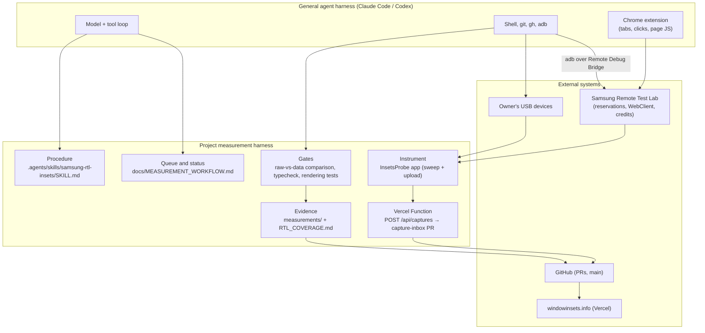
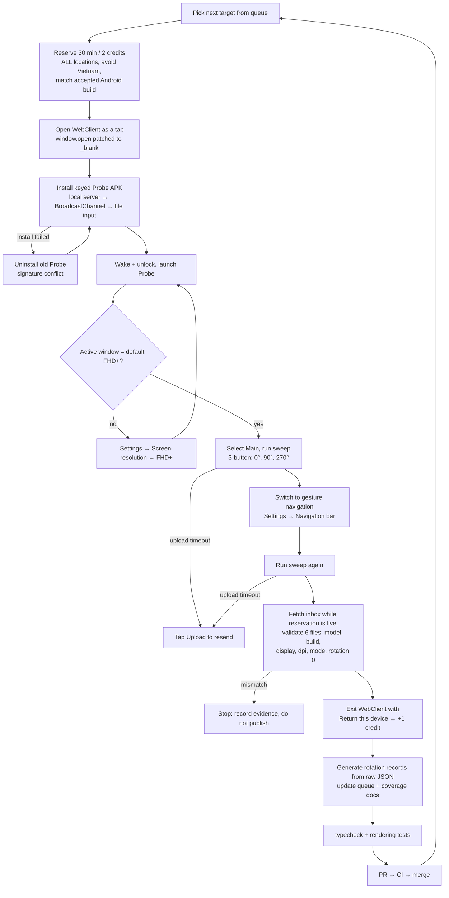
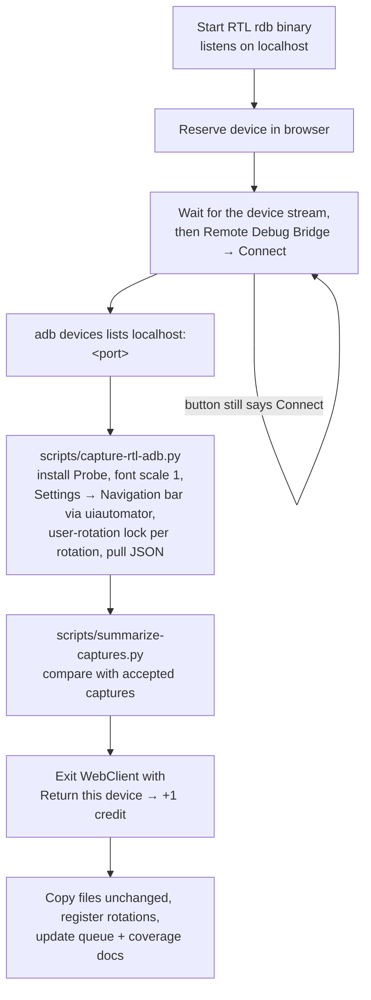

# Measurement harness

This document describes how windowinsets.info collects device measurements with
an AI agent. A general-purpose agent harness (Claude Code or Codex, with a
browser-control extension) runs a project-specific **measurement harness**: the
procedures, tools, input path and checks that let the agent repeat one
measurement loop per device and publish only verified values.

It is a loop, not a graph. Each device goes through the same linear pipeline,
with a few conditional recovery branches. There is no parallel fan-out and no
multi-agent orchestration.

## Layers

| Layer | Component | Role |
| --- | --- | --- |
| Procedure | `samsung-rtl-insets` skill | Queue order, location/OS choice, credit rules, forbidden actions, recovery steps |
| Queue | `MEASUREMENT_WORKFLOW.md` status tables | Single source for what is measured and what remains |
| Instrument | InsetsProbe 1.6.0 | Reads real `WindowInsets`, rotates itself (0°/90°/270°), labels the capture, uploads JSON |
| Input path | `api/captures.ts` (Vercel Function) → `capture-inbox` | Probe POSTs JSON to the deployed API; the function commits each upload unchanged through the GitHub API into one inbox PR |
| Gates | Comparison script, `pnpm typecheck`, `tests/rendering.test.mjs` | Block wrong screen labels, stale builds and mismatched values |
| Evidence | `measurements/<series>/<device>/recapture-*/`, coverage notes | Raw files stay immutable; every published value links to one |

## The per-device loop

A typical S-series device takes 5–10 minutes and costs 1 credit after the
refund. Since 2026-09-30 the capture steps (D–I) run headlessly over Remote
Debug Bridge instead; see the next section. USB-connected devices skip RTL entirely: ADB installs Probe, starts
`--ez sweep true`, toggles navigation with overlays and restores the owner's
setting afterwards.

## Headless capture over Remote Debug Bridge

Driving Android through WebClient screenshots was the weakest part of the loop:
the agent misread small controls, tapped stale coordinates, and spent
reservation time recovering from lag. RTL's Remote Debug Bridge (RDB) exposes
the reserved device as an ordinary adb target, so only reservation and exit
remain in the browser:

- Connect only works after the device stream has loaded (about 30–40 s); an
  earlier click closes the panel silently. Reopen the panel and click again
  until the button reads **Disconnect**.
- Navigation is selected in **Settings > Display > Navigation bar** through
  `uiautomator dump` and `input tap`. `cmd overlay` switches the mode but keeps
  Samsung's 3-button taskbar size, which produces wrong gesture insets.
- Tablet Settings shows two panes; the script scrolls the rightmost scrollable
  pane and closes first-run tips through their "Close tips" node.
- Android 16 large screens ignore the probe's orientation requests, so `--lock`
  fixes each rotation with `cmd window user-rotation lock` and exports once per
  rotation. A tablet set (2 modes × 4 rotations) takes about 90 seconds.
- Some units default to font scale 1.08; the script sets 1.0 before capturing.
- Files come straight from the device over adb, so the capture inbox is not
  needed for this path.

### Validation gate

A capture set is published only if all of these hold:

- six files: rotations 0, 1, 3 × three-button and gesture (eight with
  rotation 2 on tablets);
- `settingsSecureNavigationMode` and `configNavBarInteractionMode` agree with
  the file name (0 or 2);
- display 0, expected window size, default density and font scale 1;
- rotation 0 reproduces the accepted captures (insets, cutout rectangle);
- the build matches the accepted build, or the difference is written into the
  condition note.

Values are never derived from another rotation. Missing rotations stay pending.

## Samsung RTL vs Pixel emulator harness

Pixel devices use a second harness, `.agents/skills/pixel-emulator-insets/SKILL.md`,
built on headless Android Emulator AVDs. Both run the same InsetsProbe and the
same "raw JSON → validation → generated device records" pipeline; everything
around the instrument differs.

| Aspect | Samsung (`samsung-rtl-insets`) | Pixel (`pixel-emulator-insets`) |
| --- | --- | --- |
| Device | Real hardware in Samsung Remote Test Lab (or owner's USB device) | AVD device profile on the local host |
| Evidence class | Real-device capture | Emulator capture: framework values for a profile, never merged with real-device data |
| Control surface | Browser WebClient for reservation and exit; `adb` over Remote Debug Bridge for capture (screenshots and coordinate taps only as fallback) | `adb` shell only: `cmd`, `settings`, `adb emu fold` |
| Cost and time box | Credits, 30-minute reservation, location/build choice | Free; disk space and boot time |
| Human in the loop | Samsung sign-in, local-network permission, inbox merge | None during capture |
| Probe build | Keyed APK; uploads to the capture-inbox PR | Keyless APK; the script refuses a keyed build so emulator JSON never reaches the inbox |
| Navigation mode | Settings → Navigation bar, tapped through `uiautomator` over RDB | `cmd overlay enable-exclusive` + `settings get secure navigation_mode` check |
| Rotation | Probe sweep (0/1/3), or `cmd window user-rotation lock N` over RDB when a display ignores app requests | Probe sweep on phone-sized displays; `cmd window user-rotation lock N` on large inner displays (Android 16+ ignores app requests), all four rotations |
| Fold state | RTL toolbar toggle | `adb emu fold` / `unfold`, wait for `cmd device_state state` |
| Collection | `scripts/capture-rtl-adb.py` pulls JSON over RDB; the inbox PR remains the path without RDB | `scripts/capture-emulator.py` writes files + `manifest.json` locally |
| Registration | Per-device rotation records generated from inbox JSON | `scripts/import-emulator-captures.py` regenerates device module, AOSP skin and registry |
| Artwork | Official Samsung skins | AOSP emulator skins (Apache 2.0) |
| Typical failures | Upload timeouts, APK install failures, sessions going dark, credits spent on no-rotate displays | Duplicate adb daemons, `device offline` right after boot, stale labels when the probe survives a fold or mode change |

The practical difference: the Samsung loop is bounded by remote-lab time and
browser steps, so its skill is mostly reservation, recovery and credit rules.
With RDB the capture itself is the same kind of adb script as the Pixel loop. The
Pixel loop is a deterministic script, so its skill is mostly about keeping
emulator evidence separate from real-device evidence.

## Human checkpoints

The loop still needs a person at these points:

| Checkpoint | Why the agent stops |
| --- | --- |
| Samsung sign-in | Entering credentials is outside what the agent may do |
| First local-network permission | Chrome asks once before a page may fetch the local APK |
| Merging the capture inbox | The owner decides when a batch becomes history |
| Blog/public posts | Publishing on the owner's behalf needs explicit approval |
| Permission-classifier outages | Every tool call is blocked until the service recovers |

## Known limitations

| Limitation | Effect | Possible fix |
| --- | --- | --- |
| Coordinates come from screenshots | Resolved 2026-09-30: capture runs over Remote Debug Bridge; screenshots remain only for reservation, Connect and exit | — |
| Settings navigation is manual | Resolved 2026-09-30: `capture-rtl-adb.py` finds "Navigation bar" and the mode through `uiautomator` | A verified Samsung deep link would remove the text lookup |
| RDB Connect depends on the stream | Clicking Connect before the device stream loads fails silently | Wait for the stream, then retry until the button reads Disconnect |
| Browser session can break mid-reservation | On 2026-09-30 the WebClient returned `400 Request Header Or Cookie Too Large` and the device list 403 after capture, so the return option was unreachable | Hand the browser back to the owner; the agent does not clear Samsung cookies |
| Registration code is hand-assembled per model | Each device file has its own shape | Generate rotation records from inbox JSON with one script (already done for Fold7/Fold8/Fold8 Ultra) and make it the default path |
| Uploads can time out (seen on Russia units) | A sweep finishes but the inbox stays incomplete | Retry automatically inside Probe with backoff and show a persistent "not uploaded" state |
| Covers that never rotate | Resolved 2026-09-29: RTL's Rotate control confirmed Flip covers stay portrait | Mark such screens `fixedOrientation` instead of queueing landscape captures |
| Session state lives in chat | A reset or lost tab group loses context | Keep a machine-readable queue (JSON) and a per-device run log so any agent can resume |

The RTL skill already permits overlapping reservations in separate WebClient
tabs. Measurements remain sequential so each capture can be checked against the
active device; reserving the next device during validation does not require a
harness change.

## Where this came from

The first attempts needed a person to install the APK, wake the screen, register
the cover widget and download every JSON from the File Browser. Each blocker was
fixed in the harness rather than worked around by hand:

- WebClient popups invisible to the agent → open it as a tab;
- 27 MB APK, silent install failures → R8-shrunk debuggable APK, uninstall
  conflicting signatures;
- Probe buttons hidden under a cover cutout → Compose `LazyColumn` UI;
- File Browser downloads → keyed upload to the capture inbox;
- models hidden by the default Korea/Vietnam filter, unstable Vietnam units,
  non-default resolutions → rules in the skill;
- unreliable screenshot taps and input lag in Settings → headless adb capture
  over Remote Debug Bridge (`scripts/capture-rtl-adb.py`).

See [MEASUREMENT_WORKFLOW.md](MEASUREMENT_WORKFLOW.md) for capture rules,
[CAPTURE_UPLOAD.md](CAPTURE_UPLOAD.md) for the upload path and
[RTL_COVERAGE.md](RTL_COVERAGE.md) for per-device evidence.
