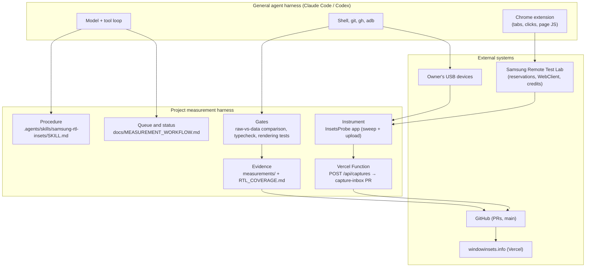
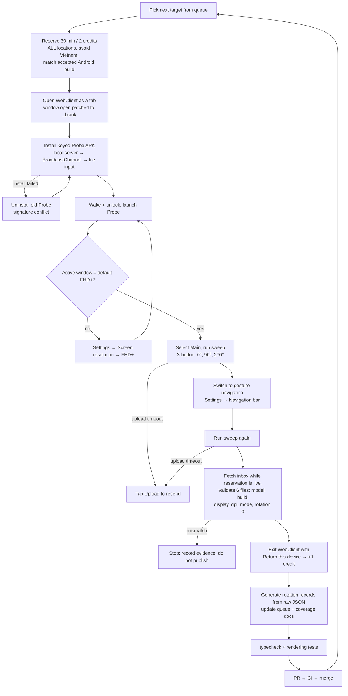

# Measurement harness

This document describes how windowinsets.info collects device measurements with
an AI agent. A general-purpose agent harness (Claude Code or Codex, with a
browser-control extension) runs a project-specific **measurement harness**: the
procedures, tools, input path and checks that let the agent repeat one
measurement loop per device and publish only verified values.

It is a loop, not a graph. Each device goes through the same linear pipeline,
with a few conditional recovery branches. There is no parallel fan-out and no
multi-agent orchestration.

## Layers

| Layer | Component | Role |
| --- | --- | --- |
| Procedure | `samsung-rtl-insets` skill | Queue order, location/OS choice, credit rules, forbidden actions, recovery steps |
| Queue | `MEASUREMENT_WORKFLOW.md` status tables | Single source for what is measured and what remains |
| Instrument | InsetsProbe 1.6.0 | Reads real `WindowInsets`, rotates itself (0°/90°/270°), labels the capture, uploads JSON |
| Input path | `api/captures.ts` (Vercel Function) → `capture-inbox` | Probe POSTs JSON to the deployed API; the function commits each upload unchanged through the GitHub API into one inbox PR |
| Gates | Comparison script, `pnpm typecheck`, `tests/rendering.test.mjs` | Block wrong screen labels, stale builds and mismatched values |
| Evidence | `measurements/<device>/recapture-*/`, coverage notes | Raw files stay immutable; every published value links to one |

## The per-device loop

A typical S-series device takes 5–10 minutes and costs 1 credit after the
refund. USB-connected devices skip RTL entirely: ADB installs Probe, starts
`--ez sweep true`, toggles navigation with overlays and restores the owner's
setting afterwards.

### Validation gate

A capture set is published only if all of these hold:

- six files: rotations 0, 1, 3 × three-button and gesture;
- `settingsSecureNavigationMode` and `configNavBarInteractionMode` agree with
  the file name (0 or 2);
- display 0, expected window size, default density and font scale 1;
- rotation 0 reproduces the accepted captures (insets, cutout rectangle);
- the build matches the accepted build, or the difference is written into the
  condition note.

Values are never derived from another rotation. Missing rotations stay pending.

## Human checkpoints

The loop still needs a person at these points:

| Checkpoint | Why the agent stops |
| --- | --- |
| Samsung sign-in | Entering credentials is outside what the agent may do |
| First local-network permission | Chrome asks once before a page may fetch the local APK |
| Merging the capture inbox | The owner decides when a batch becomes history |
| Blog/public posts | Publishing on the owner's behalf needs explicit approval |
| Permission-classifier outages | Every tool call is blocked until the service recovers |

## Known limitations

| Limitation | Effect | Possible fix |
| --- | --- | --- |
| Coordinates come from screenshots | Layout changes (density, panel size) need a fresh zoom before each tap | Drive Probe through RTL's Remote Debug Bridge (ADB) instead of pixels, or read the WebClient's device frame size and compute taps from dp |
| Settings navigation is manual | Probe already opens Display settings, but finding "Navigation bar" and selecting a mode still requires screen taps | Use a verified Samsung deep link to Navigation bar if one is available |
| Registration code is hand-assembled per model | Each device file has its own shape | Generate rotation records from inbox JSON with one script (already done for Fold7/Fold8/Fold8 Ultra) and make it the default path |
| Uploads can time out (seen on Russia units) | A sweep finishes but the inbox stays incomplete | Retry automatically inside Probe with backoff and show a persistent "not uploaded" state |
| Covers that never rotate | Flip7/Flip8 cover landscape stays pending | Test RTL's own Rotate control on covers. If it also fails, record "not supported by device" instead of "not measured" |
| Session state lives in chat | A reset or lost tab group loses context | Keep a machine-readable queue (JSON) and a per-device run log so any agent can resume |

The RTL skill already permits overlapping reservations in separate WebClient
tabs. Measurements remain sequential so each capture can be checked against the
active device; reserving the next device during validation does not require a
harness change.

## Where this came from

The first attempts needed a person to install the APK, wake the screen, register
the cover widget and download every JSON from the File Browser. Each blocker was
fixed in the harness rather than worked around by hand:

- WebClient popups invisible to the agent → open it as a tab;
- 27 MB APK, silent install failures → R8-shrunk debuggable APK, uninstall
  conflicting signatures;
- Probe buttons hidden under a cover cutout → Compose `LazyColumn` UI;
- File Browser downloads → keyed upload to the capture inbox;
- models hidden by the default Korea/Vietnam filter, unstable Vietnam units,
  non-default resolutions → rules in the skill.

See [MEASUREMENT_WORKFLOW.md](MEASUREMENT_WORKFLOW.md) for capture rules,
[CAPTURE_UPLOAD.md](CAPTURE_UPLOAD.md) for the upload path and
[RTL_COVERAGE.md](RTL_COVERAGE.md) for per-device evidence.
