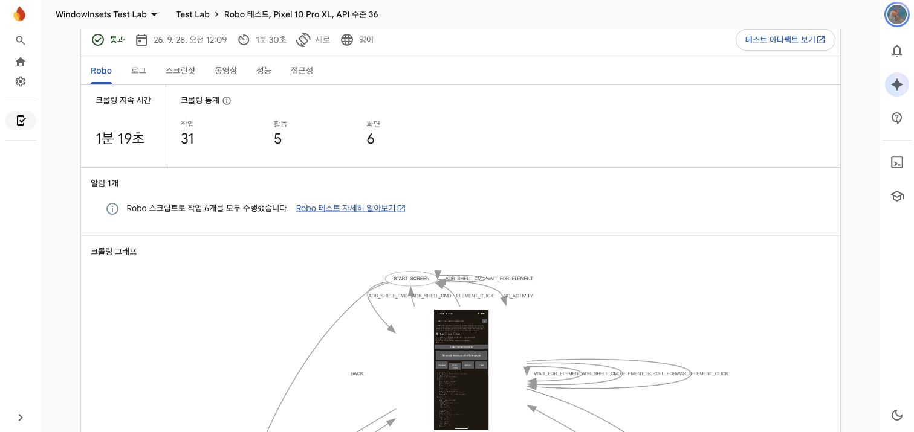
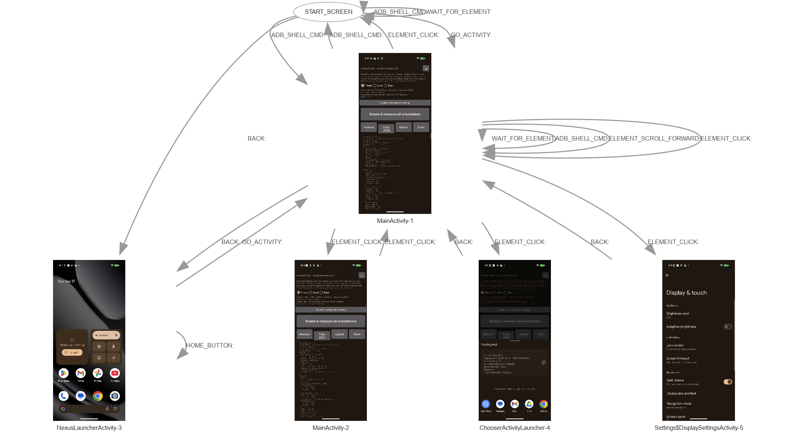

# Pixel hardware validation with Firebase Test Lab

## What the Robo test shows

Firebase Test Lab's Robo test installs the APK on a selected device and explores
its UI. A Robo script can run specified actions before that exploration. For
these inset checks, the script starts the keyless InsetsProbe with an explicit
screen label, exports a JSON capture, waits briefly, and terminates the crawl.
The JSON is the measurement evidence; a passing Robo result alone only means
the app and script ran. The console's crawl graph shows visited screens as nodes
and actions as arrows. See [Firebase's Robo test guide](https://firebase.google.com/docs/test-lab/android/robo-ux-test).

The first Pixel 10 Pro XL pilot continued into automatic UI exploration after
one script assertion failed. Its console view and **complete exported crawl
graph** are preserved below. The graph includes launcher and Settings screens
that Robo reached during this extra exploration; those screens are not inset
measurements. Later scripts terminate after the intended export.





The published Pixel values come from local Android Emulator profiles. They are
labelled `emulator` evidence, not Pixel hardware measurements. Issue #23 treats
Firebase Test Lab (FTL) physical devices as a later spot check. A successful
emulator capture does not establish that a physical device reports the same
cutout, rounded corners or insets.

## Physical-device capture procedure

1. Use the dedicated `windowinsets-testlab-2026` Firebase project. It was
   created on 2026-09-28 under the maintainer's Google account with Google
   Analytics disabled. The first five physical runs used Spark. On 2026-09-28,
   the maintainer created a separate billing account and linked it to this
   project, switching it to Blaze. Blaze includes 30 physical-device test
   minutes per project per day, then charges $5 per device-hour in one-minute
   increments. Check the current quota and billing state before running more
   tests; budget alerts are not spending caps. Do not add an upload
   key to the probe APK: a keyed
   build automatically sends a sweep to the real-device capture inbox.
2. List the **current physical** models and supported Android versions with
   `gcloud firebase test android models list --filter=physical --project PROJECT_ID`.
   Verify the selected model with `models describe MODEL_ID`; the FTL catalog
   changes and the model name alone does not identify an OS build.
3. Build the keyless probe and make an immutable copy outside Gradle's shared
   build path:

   ```bash
   (cd tools/insets-probe && ./gradlew :app:assembleDebug -PinsetsProbeUploadKey=)
   cp tools/insets-probe/app/build/outputs/apk/debug/app-debug.apk /tmp/insets-probe-ftl-keyless.apk
   ```

4. Run one short Robo test on a **physical Pixel phone**. Replace the project,
   model and version placeholders with values from the current catalog:

   ```bash
   gcloud firebase test android run \
     --project PROJECT_ID \
     --type robo \
     --app /tmp/insets-probe-ftl-keyless.apk \
     --robo-script tools/insets-probe/testlab/phone-portrait.robo.json \
     --device model=MODEL_ID,version=OS_VERSION_ID,locale=en,orientation=portrait \
     --directories-to-pull /sdcard/Android/data/info.windowinsets.probe/files \
     --timeout=2m \
     --client-details matrixLabel=Pixel-hardware-insets-pilot
   ```

   The script clears earlier exports, launches InsetsProbe with `screen=phone`
   and `export=true`, waits for a settled capture, then stops the crawl. The
   timeout bounds each device execution. Verify
   the resulting JSON after downloading it. Test Lab pulls files from this
   app-specific directory successfully on the tested Pixel 10 Pro XL.

5. Keep the downloaded JSON unchanged in a dated physical-device evidence
   folder separate from `emulator-*/`. Check `device.model`, Android/build ID,
   `screen`, rotation, full-window size, density, font scale, navigation mode,
   `settingAgreesWithInsets`, cutout bounds/path and rounded corners before
   comparing with the matching emulator capture. Do not relabel or overwrite
   either source. A mismatch is a finding, not a value to silently replace.

The first pilot covers one portrait screen in the device's existing navigation
mode. A separate test plan is needed for the other navigation mode, rotations,
and Fold cover/inner states. Do not claim a complete hardware validation from
one successful test. Prioritize the Pixel 10 Pro Fold inner cutout and corners:
its emulator profile reported the same geometry as Pixel 9 Pro Fold. If the
exact Fold models are unavailable in FTL, report that catalog limitation and
use factory-image overlays as a geometry cross-check without calling them
runtime hardware measurements.

The catalog checked on 2026-09-28 offers physical Pixel 10 Pro XL (`mustang`)
and Pixel 10 Pro Fold (`rango`) on API 36, Pixel Tablet (`tangorpro`) on API 33
and 36, and Pixel Watch (`r11`) on API 30. The FTL catalog includes physical
models for 20 of the 22 public Pixel entries at the time; Pixel
6 Pro and Pixel 4a are absent from this snapshot. Requesting those models or
using a supplied physical device is needed for their hardware measurements.
The published local Pixel emulator captures use API 37, so an FTL difference
can also reflect the OS version. The
catalog reports 1080×2404 for `mustang`, while its local emulator profile uses
1344×2992; compare dp and geometry relative to the active display dimensions,
and record the physical device's actual reported resolution. The current FTL
catalog contains no Galaxy Watch model. Test Lab measurements do not supply
device artwork. Issue #35 concerned the Pixel Tablet frame's contrast and was
fixed separately on the website in PR #42.

## First run: Pixel 10 Pro XL

The first Spark test matrix, `matrix-2lt0sk1fhxcls`, ran on physical `mustang`
with API 36 and passed. [FTL result](https://console.firebase.google.com/project/windowinsets-testlab-2026/testlab/histories/bh.72510f2109b9f626/matrices/7029552250955893712).
The keyless APK produced a portrait gesture capture at 1080×2404, 390 dpi,
Android 16, build `BD1A.250702.001`. Both navigation detectors agreed. The
Google-hosted result bucket successfully collected JSON from the app-specific
directory. The first script's `ls` command had an `expectedOutputRegex` that
Robo marked as a script action failure even though the command action reported
success. Robo then explored the app and generated four additional captures.
The script now skips the inline `ls` check and leaves file validation to the
download step; verify the corrected termination behavior on the next run.
The portrait file retained by the Robo exploration has `screen=main` even
though this is a bar phone: the probe's screen label is manual and does not
switch the display. Its display and cutout geometry are useful for this spot
check, but it is not a valid phone-labelled capture for direct publication.
Re-run this model with the corrected script before using an FTL value as a
published measured source.

The portrait cutout **path** spans about 31.6×31.6 dp on the physical phone,
versus about 31.3×31.3 dp on the API 37 emulator. Display corner radius is
50.46 dp versus 51 dp. The OS exclusion rectangle is different: physical
cutout/top inset 66.05 dp, emulator 53 dp. These captures also differ in
Android version and active resolution, so this run validates the near-matching
physical camera path and corner shape but does not explain the exclusion-area
difference. Keep the physical capture as separate evidence and do not replace
published emulator values from this one comparison.

## Second run: Pixel 10 Pro Fold inner display

The second Spark test matrix, `matrix-27vyvgp301kyl`, ran on physical `rango`
with API 36 and passed. [FTL result](https://console.firebase.google.com/project/windowinsets-testlab-2026/testlab/histories/bh.72510f2109b9f626/matrices/5415288884619478105).
The revised script captured one `main-gesture.json` and ended the Robo crawl.
The capture reports Pixel 10 Pro Fold, Android 16 build `BD3A.251005.003`,
2076×2152, 390 dpi, rotation 0, gesture navigation, and agreement between
navigation detectors. These display dimensions match the API 37 emulator.
The cutout path and all four display corner radii match the emulator capture
at the recorded precision. Its OS cutout exclusion rectangle reaches 160 px
from the top, versus 136 px on the emulator. The Android versions differ, so
this comparison does not establish the cause of that safe-inset difference.
The physical capture is preserved separately in
`measurements/pixel/pixel-10-pro-fold/testlab-2026-09-28/`.

## Third run: Pixel 9 Pro Fold inner display

The third Spark test matrix, `matrix-e370qxayj12ua`, ran on physical `comet`
with API 36 and passed. [FTL result](https://console.firebase.google.com/project/windowinsets-testlab-2026/testlab/histories/bh.72510f2109b9f626/matrices/8502694126242610502).
The script exported one `main-gesture.json` from Android 16 build
`CP1A.260305.018`, 2076×2152, 390 dpi, rotation 0, gesture mode with agreeing
navigation detectors. The cutout exclusion rectangle, sampled camera path and
four corner radii match the Pixel 9 Pro Fold API 37 emulator exactly at recorded
precision. This supports the emulator geometry for the 9 Pro Fold, while the
10 Pro Fold physical safe inset still differs from its emulator capture. Its
raw result is preserved in `measurements/pixel/pixel-9-pro-fold/testlab-2026-09-28/`.

## Fourth matrix: Pixel 8 Pro and Pixel Tablet

The fourth Spark matrix, `matrix-3ehvin61s5bsg`, passed on physical Pixel 8
Pro (`husky`, API 35) and Pixel Tablet (`tangorpro`, API 36), consuming two
physical-device runs. [FTL results](https://console.firebase.google.com/project/windowinsets-testlab-2026/testlab/histories/bh.72510f2109b9f626/matrices/8103305516082310900).
Both scripts exported one portrait gesture JSON and ended normally; their
navigation detectors agreed. Raw files and action logs are preserved in the
respective `measurements/pixel/<slug>/testlab-2026-09-28/` directories.

Pixel 8 Pro: the physical Android 15 build `BP1A.250505.005.B1` uses an active
1008×2244 resolution at 360 dpi, while the API 37 emulator uses 1344×2992 at
480 dpi. The sampled camera path has identical dp bounds in both captures.
Physical top cutout/status inset is 50.22 dp versus 50.33 dp on the emulator;
corner radii are 30.22 dp versus 30.33 dp. The active resolution and OS differ,
so retain both provenance records.

Pixel Tablet: the physical Android 16 build `CP1A.260305.018` was captured in
portrait at 1600×2560, with display corner radii of 14 dp at the top and
13.5 dp at the bottom. The API 37 emulator's rotation-0 capture is landscape
2560×1600 and reports null corners. The physical top status inset is 36 dp,
versus 24 dp on that emulator capture. Different orientation and Android
version make these findings **unresolved**, not proof that the emulator's
tablet profile is wrong. Re-run one source in the other's orientation before
deciding whether to change published values. Both report no display cutout.

## Blaze continuation on 2026-09-28

After five Spark executions, a newly created billing account was linked to the
dedicated project. Seventeen more physical-device executions were submitted
with `--timeout=2m`: a corrected Pixel 10 Pro XL capture, a landscape Pixel
Tablet capture, fourteen previously unchecked catalog models, and a matched
landscape inner-screen Pixel Fold recapture. All 17 executions passed and
produced an exported JSON. The new phone batch is
[matrix-3qe6bitme0p6b](https://console.firebase.google.com/project/windowinsets-testlab-2026/testlab/histories/bh.72510f2109b9f626/matrices/5423514632819986165);
individual result URLs and SHA-256 checksums are in each capture manifest.
The Pixel 10 Pro XL, Tablet and Fold recaptures have separate subdirectories,
so none of the earlier raw files were changed.

The result is **19 of 22 public Pixel models spot-checked on physical FTL
devices**. Every new JSON identifies the expected Google Pixel model and API,
reports gesture navigation with both detectors agreeing, and is a full-window
capture. This checks one screen and navigation mode per model, not every
orientation, navigation mode, or Fold cover state. All published site values
continue to carry their original API 37 emulator provenance. FTL devices here
ran API 32–36, so differences cannot yet be assigned solely to hardware.

The camera path and display corner radii match the AVD values at recorded
precision for Pixel 10 Pro Fold, Pixel 9 Pro Fold, Pixel 9, Pixel 8, Pixel 8a,
Pixel 7, Pixel 7a, Pixel 6 and Pixel 6a. Pixel 10 Pro XL, Pixel 9 Pro XL,
Pixel 9 Pro, Pixel 8 Pro and Pixel 7 Pro are close (roughly 0.1–0.5 dp in
path size or corner radius). The physical Pixel 10 Pro path is about 1.2 dp
smaller and its corner radius about 2 dp smaller; Pixel 10's corner radius
is about 2.3 dp larger. Pixel 9a's physical corner radius is 43.81 dp versus
50.29 dp in the AVD, despite a near-matching camera path. These differences
remain findings, not corrections to raw captures or published values.

The safe top cutout inset can differ even when the camera path matches. For
example, the correctly labelled Pixel 10 Pro XL recapture reports 66.05 dp
versus 53 dp in the AVD. Pixel 9 reports 65.90 versus 54.10 dp, and Pixel 6a
reports 44.95 versus 50.29 dp. Pixel 8, 8a, 7, 7a and 6 match the AVD top
cutout inset, while Pixel 8 Pro and 7 Pro are within about 0.2 dp. Preserve
these OS- and resolution-dependent differences with both source labels.

The matched-size, rotation-0 Pixel Fold inner recapture reports a 2208×1840
screen and physical corner radii of 19.81 dp at the top and 18.29 dp at the
bottom. The AVD reports `null` corners at the same size and rotation. Neither
source reports a cutout on this inner screen; the physical status-bar top inset
is 41.90 dp versus 28.19 dp in the AVD. The initial Fold batch capture was
portrait, rotation 1 and manually labelled `phone`; it is retained as evidence
but was not used for this matched comparison.

The Pixel Tablet landscape recapture reports 2560×1600 and rounded corners
of 14 and 13.5 dp. The AVD's landscape capture at the same dimensions reports
`null` corners. Both report no cutout. The physical status-bar top inset is
36 dp versus 24 dp in the AVD. The physical capture is rotation 1 and the AVD
is rotation 0; the display orientation and dimensions match, but the OS build
and rotation index still differ. The earlier portrait physical capture remains
separate evidence.

### Pixel 5 on API 30 (2026-10-01)

FTL offers Pixel 5 (`redfin`) only on API 30. InsetsProbe 1.7.0 lowers
`minSdk` to 30: on API 30 it records `displayCutout.path` and `roundedCorners`
as `null` and lists them in `apiLimits`, because `getCutoutPath()` and
`RoundedCorner` arrived in API 31. Robo ADB shell steps did not run on this
device (the first attempt stopped at `am force-stop`), so the probe exports
once on a plain launch when the `firebase.test.lab` system setting is `true`,
using its default `phone` label, and
`tools/insets-probe/testlab/phone-portrait-launch-only.robo.json` only waits.
The passing run is preserved in
`measurements/pixel/pixel-5/testlab-2026-10-01/` with its manifest and hashes.

The physical capture (Android 11, build `RQ3A.211001.001`, gesture mode, both
detectors agreeing) matches the API 37 AVD on window size (1080×2340 px),
density (440 dpi) and the top-left cutout (inset 136 px, bounds
0,0–136,136 px). System bars differ with the OS version: status bar 145 px
versus 136 px in the AVD, and the gesture navigation bar 44 px versus 66 px.
Cutout path and corner radii could not be compared on API 30. These remain
findings; the published emulator values are unchanged.

### Pixel 10a and a Robo change (2026-10-01)

Pixel 10a (`stallion`, API 36, build `CP1A.260505.005`) was added from the
AVD the same day. Its first run with `phone-portrait.robo.json`
(`matrix-2adqpl4s5g8rg`) also stopped at the first ADB shell step, although the
same script passed on API 32–36 devices on 2026-09-28. Robo shell steps
therefore no longer run reliably, independent of API level. A rerun with
`phone-portrait-launch-only.robo.json` (`matrix-23sw6o4bhn4ez`) passed; the
capture is in `measurements/pixel/pixel-10a/testlab-2026-10-01/`.

It matches the API 37 AVD on window size (1080×2424 px), density (420 dpi) and
the gesture navigation bar (63 px). The top cutout inset and status bar are
152 px versus 142 px, the cutout bounds 484–596 × 0–152 px versus 485–595 ×
0–142 px, and the corner radius 115 px (43.81 dp) versus 132 px (50.29 dp),
the same corner difference recorded for Pixel 9a. These remain findings.

Use the launch-only script for phone captures until shell steps work again.
Scripts that need extras (Fold inner, tablet labels) still depend on shell
steps and should be retried before a batch.

That brings the physical spot check to **21 of 23 public Pixel models**. Pixel
6 Pro and Pixel 4a were still absent from the FTL physical catalog checked on
2026-10-01. The remaining blockers are tracked in
[issue #46](https://github.com/easyhooon/windowinsets.info/issues/46).

Blaze billing is active for the dedicated FTL project. The 30-minute daily
allowance and $5/device-hour overage are service pricing, not a confirmed
invoice; inspect Cloud Billing for actual charges. The 2-minute per-device
limit bounded these runs, and all completed well below that limit. The prior
Spark-only two-day schedule is obsolete after this batch. Issue #35 was a
website contrast issue and was fixed separately in PR #42.

References: [FTL device catalog](https://firebase.google.com/docs/test-lab/android/available-testing-devices),
[Robo script commands](https://firebase.google.com/docs/test-lab/android/robo-scripts-reference),
[results-directory collection](https://cloud.google.com/sdk/gcloud/reference/firebase/test/android/run),
[Test Lab quotas and pricing](https://firebase.google.com/docs/test-lab/usage-quotas-pricing).
