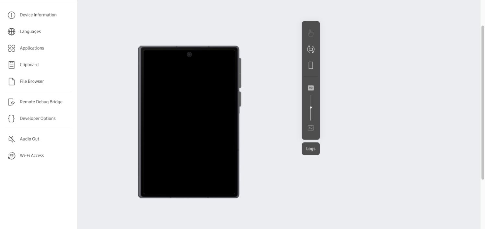
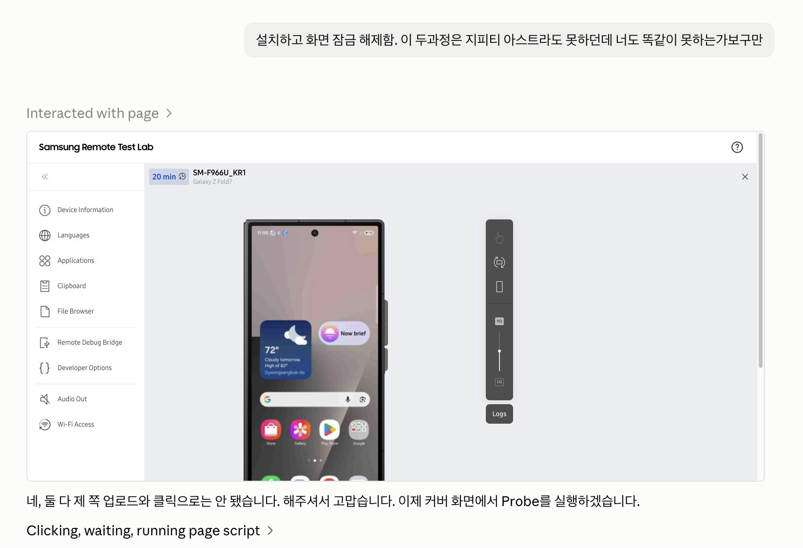
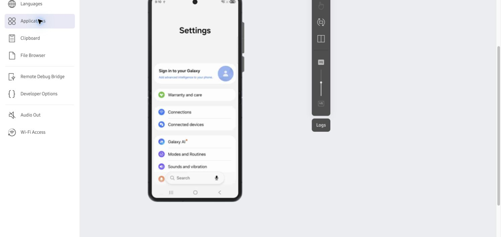
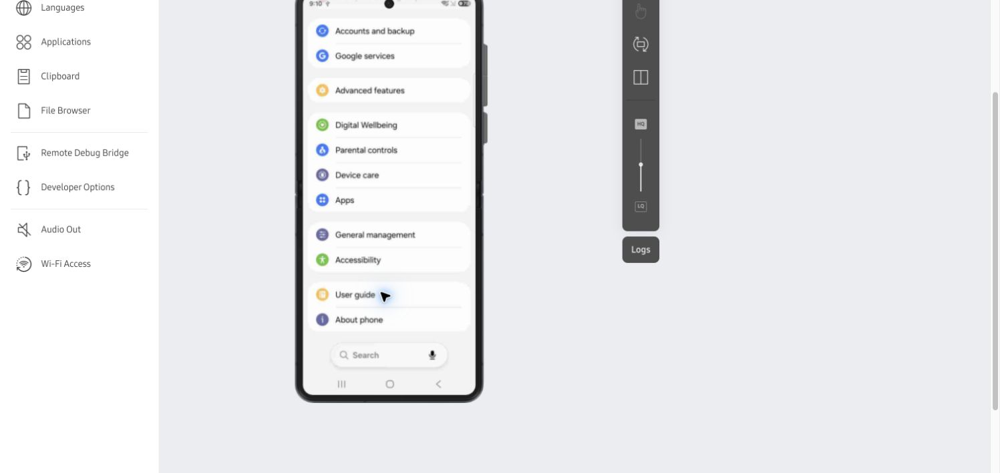
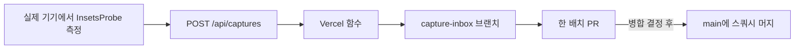
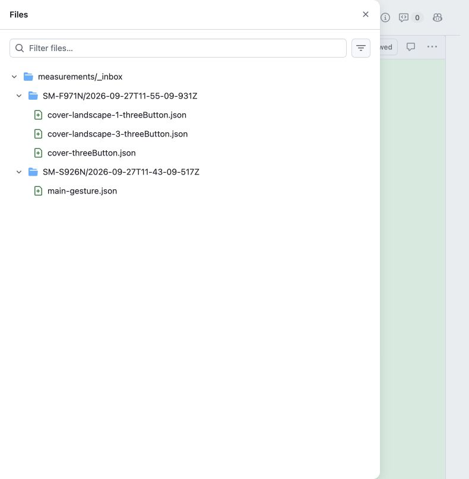
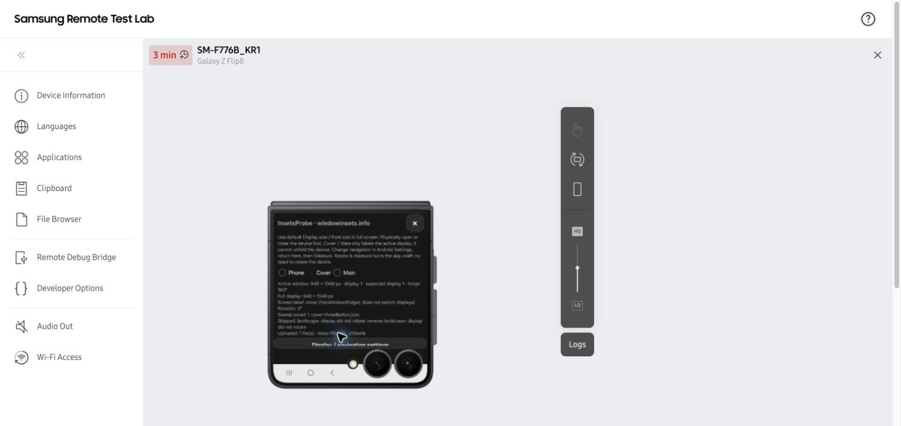

<!-- Velog 제목: WindowInsets.info 측정 자동화 삽질기: RTL 조작부터 API 업로드까지 -->

#### 부제: 나보다 훨씬 똑똑하다고 믿었던 모델이 전원 버튼 하나에 막혔다. 그 시행착오를 줄여 측정을 자동화하기까지

## 서두

[windowinsets.info](https://windowinsets.info)를 만들고 있다. Android 기기별 상태 표시줄, 내비게이션 바, 제스처 영역, 화면 잘림과 폴더블 힌지 정보를 그림으로 보여 주는 사이트다. 개발자가 자기 화면에서 콘텐츠가 어디까지 안전하게 놓일 수 있는지 살펴볼 수 있게 하려는 프로젝트다.

이 값은 기종과 화면, 회전 방향, 내비게이션 방식에 따라 달라진다. 그래서 작은 Android 앱인 **InsetsProbe**를 만들어 실기기와 Samsung Remote Test Lab(RTL)에서 값을 JSON으로 기록해 왔다. 기기가 많아질수록 측정 코드보다 **기기를 조작하고 파일을 내 컴퓨터까지 옮기는 과정**이 더 큰 일이 됐다.

처음에는 당시 사용자에게 제공된 OpenAI의 최상위 GPT-6 모델, Astra에게 RTL 기기를 맡기면 이 반복 작업이 빨리 끝날 줄 알았다. 그런데 검은 화면을 깨울 사이드 버튼을 못 누르고, 설정을 한 번 스크롤하면 메뉴를 다시 찾느라 헤맸다. JSON을 저장한 뒤에는 RTL File Browser에서 내려받는 일도 오래 걸렸다.

어제까지만 해도 내가 직접 파일을 받아 Astra에게 넘기는 편이 빨랐다. 하지만 가로 화면을 추가하려면 약 120종을 다시 예약하고 같은 일을 반복해야 했다. 이 글은 그 병목을 겪고, Probe에서 GitHub PR까지 직접 업로드하는 흐름을 만든 기록이다. 마지막에는 가로 90°와 270°를 각각 측정해야 하는지 파일럿 데이터로 판단했다.

## 문제 1. 검은 화면에서 사이드 버튼을 누르지 못했다

### 문제 발생

RTL WebClient에 Probe APK를 설치해도 기기 화면이 검게 보일 때가 있었다. 화면을 켜려면 앱 안의 버튼이 아니라 WebClient가 그린 휴대폰 **프레임의 사이드 버튼**을 눌러야 했다.

브라우저 메뉴는 접근성 트리에서 이름을 찾을 수 있지만, 원격 Android 화면과 기기 프레임은 주로 픽셀로 보인다. Astra는 스크린샷에서 버튼처럼 보이는 돌출부를 찾아 좌표를 누르고, 다음 스크린샷에서 성공했는지 다시 확인해야 했다.

*Fold8의 검은 화면. 눌러야 할 사이드 버튼은 앱 화면 밖, RTL이 그린 기기 프레임에 있다.*

문제는 버튼을 알고도 클릭이 실제 기기에 전달됐는지 확신하기 어려웠다는 점이다. Fold8과 Flip8 파일럿에서도 Astra가 버튼을 눌러 보았지만 화면은 계속 검었다. 내가 화면을 깨우고 잠금을 풀어 준 뒤에야 다음 단계로 갈 수 있었다.

> 혹시 Claude의 최상위 모델인 [Opus 5.5](https://www.anthropic.com/claude-opus-5-5)는 다를까 싶어 Fold7 RTL에서 APK 설치와 잠금 해제도 맡겨 봤다. 하지만 업로드와 클릭이 뜻대로 되지 않아 결국 내가 직접 두 단계를 끝냈다. 이번에는 모델을 바꿔도 원격 기기 조작의 어려움이 그대로였다. 그래도 응답은 Opus 쪽이 좀 더 빠릿빠릿하게 느껴져 마음에 들었다. Astra와 GPT도 이 부분은 분발했으면 싶다.

*Opus 5.5로도 업로드와 클릭이 되지 않아 내가 설치와 잠금 해제를 마친 뒤 이어서 작업했다.*

### 문제 해결

이번에는 이 단계를 억지로 자동화하지 않았다. **전원 버튼과 잠금 해제는 내가 맡고, 화면이 실제로 켜진 것을 확인한 뒤 Astra가 이어받는 방식**으로 정했다. 한 번 외운 좌표를 계속 누르지 않으니 예약 시간을 덜 허비했다.

다만 커버 화면을 깨운 뒤에도 금방 다시 꺼졌다. Flip8에서는 내가 한 번 더 화면을 켜 주고, Astra가 잠금 화면을 올린 뒤 위젯까지 넘겼다. ‘화면이 켜졌다’는 말만으로 잠금 해제와 앱 실행까지 끝난 것은 아니었다.

## 문제 2. 설정을 스크롤하자 이전 스크린샷이 틀렸다

### 문제 발생

WindowInsets는 제스처와 3버튼 내비게이션에서 값이 달라진다. 두 모드를 측정하려면 Android 설정에서 내비게이션 방식을 바꿔야 한다. 그런데 Astra가 스크린샷에서 찾은 메뉴 위치는 한 번 스크롤한 뒤 더 이상 맞지 않았다.

사람은 목록이 움직이는 동안 같은 항목을 눈으로 따라간다. Astra의 조작은 **화면 A를 보고 판단 → 스크롤 → 화면 B를 다시 관찰**하는 단계로 끊긴다. B를 확인하지 않고 A의 좌표로 누르면 엉뚱한 메뉴를 열게 된다.

*Flip8 설정 메뉴를 스크롤하기 전과 후. 다음 클릭은 반드시 바뀐 화면에서 다시 찾아야 했다.*

처음에는 앱에서 `Settings.Secure.putInt(navigation_mode, ...)`로 모드 변경도 시도했다. 호출 경로의 오류를 고쳐도 Samsung RTL 기기는 요청을 적용하지 않았다. 새 JSON은 계속 3버튼 모드였다.

### 문제 해결

Probe에 **Display / navigation settings** 버튼과 **× 종료 버튼**을 넣어 설정 앱으로 이동하기 쉽게 했다. 설정을 스크롤한 뒤에는 반드시 새 화면에서 항목을 다시 찾도록 했다. 모드 변경 여부는 요청 코드가 아니라 Android 설정과 새 캡처의 `navigation.mode`로 판단한다.

이번 파일럿에서는 3버튼 모드의 Fold8·Flip8 데이터를 우선 모았다. 제스처로 바꾸지 않은 캡처를 제스처 데이터라고 부르지 않았다.

## 문제 3. 파일은 저장됐는데 내려받기가 오래 걸렸다

### 문제 발생

기존에는 RTL File Browser에서 `Android/data/info.windowinsets.probe/files`로 들어가 JSON을 내려받았다. 파일 행에 마우스를 올려야 다운로드 아이콘이 나타났다. 호스트에 도착한 이름도 `main-gesture.json` 대신 `content`, `content (1)`처럼 바뀌었다.

<!-- 실제 File Browser JSON 행과 마우스를 올렸을 때 나타나는 다운로드 아이콘 스크린샷을 나중에 삽입 -->

다운로드를 눌렀다는 사실과 파일이 내 컴퓨터에 도착했다는 사실도 별개였다. Flip3에서는 기기에 저장된 제스처 JSON을 끝내 받지 못해 다음 예약에서 다시 측정했다. 한 파일씩 열어 모델, 화면, 모드와 크기를 확인하는 수작업도 계속됐다.

### 문제 해결

InsetsProbe가 JSON을 `/api/captures`로 직접 보내게 했다. Vercel 함수가 요청을 받아 GitHub의 `capture-inbox` 브랜치에 원본을 커밋한다. 업로드마다 PR을 만들지 않고 여러 캡처를 **하나의 PR**에 모은다. 병합 여부는 내가 결정하고, 병합할 때는 스쿼시 커밋으로 묶는다.

첫 프리뷰에서는 API가 404였고, 배포 뒤에는 ESM import 오류로 500이 났다. 이를 고친 다음 GitHub PAT와 업로드 키를 Production에 넣었다. 기존 S24+ JSON 재전송에서 HTTP 201과 [PR #30](https://github.com/easyhooon/windowinsets.info/pull/30)의 커밋을 확인했다. 여기까지는 업로드 경로만 시험한 것이었다.

이후 Fold8과 Flip8을 실제 RTL에서 예약해 APK를 설치했다. **Probe 버튼을 눌러 만든 새 JSON이 같은 PR에 도착하는 것까지 확인했다.** Fold8 커버와 Flip8 메인은 세로·가로 양방향 캡처가 올라왔다.

*이제 RTL File Browser를 거치지 않고, Probe가 측정한 JSON을 직접 전송한다.*

## 문제 4. 업로드가 성공해도 화면 라벨은 틀릴 수 있었다

### 문제 발생

Fold8의 과거 `main` JSON은 1248 × 1972px였다. 이 크기는 내측이 아니라 커버 화면과 맞는다. 예전 **Measure All**의 Cover/Main 선택은 실제 디스플레이를 바꾸지 않고 파일 라벨만 바꿨다.

이번 파일럿에서도 비슷한 실수를 했다. Fold8을 펼친 직후 Cover 라벨을 그대로 둔 채 한 번 측정해, 실제 2448 × 1848px 내측 화면이 `cover-threeButton.json`으로 올라갔다. API 성공은 **전송 성공**이지, 화면 분류가 맞다는 뜻이 아니었다.

### 문제 해결

폴더블 화면은 RTL의 접힘 제어로 실제 전환하고, Probe가 보고한 창 크기와 디스플레이를 확인한다. Fold8 커버는 1248 × 1972px, 내측은 2448 × 1848px로 구분했다. 잘못 표기된 원본은 고치지 않고 증거로 남기되, 유효한 커버 측정으로 사용하지 않는다.

Probe의 회전 스윕도 화면이 실제로 돌아갔을 때만 파일을 저장한다. Flip8 커버 위젯은 Display 1에서 948 × 1048px 세로 캡처를 업로드했지만, 가로 요청은 적용되지 않아 가로 파일을 만들지 않았다.

*Flip8 커버 화면에서 직접 측정하고 업로드했다. 기기가 허용하지 않은 가로 값은 채우지 않았다.*

## 문제 5. 가로 90° 하나를 뒤집어 270°로 쓸 수 있을까?

### 문제 발생

가로 데이터를 다시 모을 때 가장 궁금했던 건 이거였다. 90°와 270°가 같은 값이라면 하나만 찍고 뒤집어 쓰면 된다. 다르다면 약 120종에서 두 방향을 각각 측정해야 한다.

S23+ 바형, Fold8 커버, Flip8 메인을 같은 3버튼 조건으로 비교했다. 세 기기 모두 화면 크기는 같았지만, 상태 표시줄은 **두 방향 모두 위쪽**에 남았다. 내비게이션 바와 카메라 잘림 영역은 오른쪽에서 왼쪽으로 옮겨 갔다.

| 기기 | 90° 상태 표시줄 / 내비게이션 바 / 잘림 영역 | 270°에서 달라진 점 |
| --- | --- | --- |
| S23+ | 위 84px / 오른쪽 135px / 왼쪽 74px | 상태 표시줄은 위 84px, 나머지는 좌우 반대 |
| Fold8 커버 | 위 79px / 오른쪽 126px / 왼쪽 104px | 상태 표시줄은 위 79px, 나머지는 좌우 반대 |
| Flip8 메인 | 위 90px / 오른쪽 144px / 왼쪽 108px | 상태 표시줄은 위 90px, 나머지는 좌우 반대 |

90° 캡처를 **180° 돌리면** 상태 표시줄까지 아래로 가므로 270° 실측값과 틀린다. 이 세 사례에서는 좌우 반전이 맞았지만, 모두 3버튼 모드였다. 제스처 모드와 다른 기종까지 같은 규칙이 적용된다고 단정할 수는 없다.

### 문제 해결

**90°와 270°는 각각 실측한다**고 결정했다. Probe의 회전 스윕은 한 번 누르면 두 방향을 연달아 시도한다. 별도 예약을 한 번 더 할 필요는 없다. 기기가 회전을 허용하지 않으면 그 방향은 저장하지 않고 미측정으로 남긴다.

이렇게 해야 사이트에서 보여 주는 값이 실제 기기에서 나온 측정인지 분명해진다. 좌우 반전으로 만든 그림이 필요하더라도 실측한 270° 데이터인 것처럼 표시하지 않는다.

## 결론

한 대만 보면 내가 직접 버튼을 누르고 파일을 받는 편이 빨랐다. 하지만 기종 약 120개에 화면·방향·내비게이션 조합이 늘어나자, 그 방식은 감당하기 어려워졌다. 그래서 사람이 기기를 준비한 뒤 **Probe가 가능한 회전을 측정하고 JSON을 전송하는 흐름**으로 바꿨다.

실제 Fold8·Flip8 파일럿으로 Probe → Vercel → GitHub PR까지 확인했다. 90°와 270°는 단순 회전으로 같은 값이 되지 않아 둘 다 실측하기로 했다. 사이드 버튼과 잠금 해제는 여전히 사람의 도움이 필요했고, 잘못 고른 화면 라벨은 업로드 전에 자동으로 막지 못했다. 원본 파일은 PR #30에서 스쿼시 머지했다. 이 머지는 증거 보관 단계이며, 사이트에 방향별 실측값을 연결하는 작업은 별개다.

Astra가 간단한 버튼에서 헤맨 이유도 조금은 알 것 같다. 웹 메뉴, 원격 화면, 기기 프레임은 조작 방식이 달랐다. 특히 스크린샷 한 장은 스크롤이나 화면 꺼짐 뒤의 상태를 보장하지 않는다. 다음 행동 전에 현재 화면을 다시 확인하는 절차가 필요했다.

## P.S. 인간 데이터 수집기를 졸업하며

내가 직접 파일을 받아 넘기는 편이 빠르다고 느낀 게 불과 어제였다. 오늘은 그 일을 없애려고 코드를 고쳤다. 친구와 얘기하다 보니, 내가 하던 자리를 내가 줄이고 있다는 생각도 들었다.

이 고민에 깔끔한 답은 없을 것 같다. 그래도 이 프로젝트를 시작한 이유는 분명하다. 내가 겪은 번거로움을 다른 사람은 덜 겪게 하는 제품을 만들고 싶었다. 이번에는 그 ‘다른 사람’에 미래의 나도 들어간다. 손으로 파일을 옮기는 시간 대신 화면 데이터를 더 잘 설명하는 데 시간을 쓰고 싶다.

## 참고 자료

- [windowinsets.info](https://windowinsets.info)
- [프로젝트 저장소와 InsetsProbe](https://github.com/easyhooon/windowinsets.info)
- [캡처 업로드 구현 PR #29](https://github.com/easyhooon/windowinsets.info/pull/29)
- [실제 RTL 업로드가 모인 PR #30](https://github.com/easyhooon/windowinsets.info/pull/30)
- [Android `setRequestedOrientation()`](https://developer.android.com/reference/android/app/Activity#setRequestedOrientation(int))
