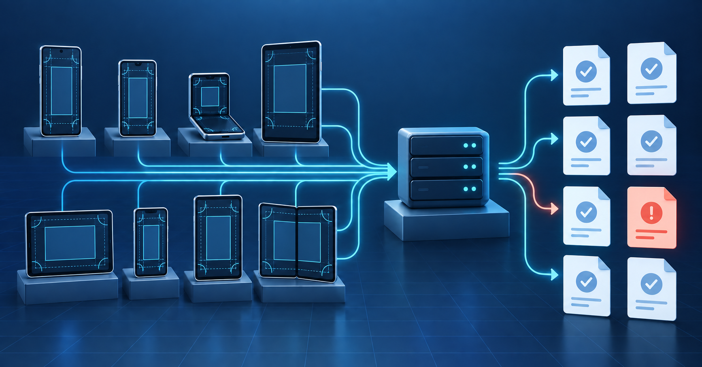
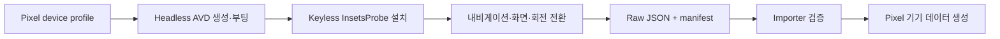

#### 부제: 화면 없는 에뮬레이터 22종에서 158개 WindowInsets 캡처를 모으기까지



## 서두

[1탄](https://velog.io/@mraz3068/windowinsets-rtl-automation)에서는 [windowinsets.info](https://windowinsets.info)에 필요한 Samsung Remote Test Lab 기기를 직접 조작하고, InsetsProbe가 측정한 JSON을 Vercel Function을 통해 GitHub PR로 보내는 흐름을 만들었다. 삼성 기기는 실제 기기에서 값을 얻을 수 있었지만, Pixel 기종을 추가할 때는 같은 방법을 쓸 수 없었다. Samsung RTL처럼 여러 Pixel 기기를 빌려 주는 환경이 없었기 때문이다.

대신 Android SDK에는 Pixel device profile과 AOSP emulator skin이 들어 있다. 그렇다면 화면을 띄우지 않는 Android Emulator를 기종별로 실행하고, InsetsProbe를 설치한 뒤 내비게이션 방식·화면·회전을 바꾸며 JSON을 모으면 된다. 처음에는 이 정도면 단순한 반복문으로 끝날 줄 알았다.

그런데 자동화할 대상은 앱 실행만이 아니었다. 바형 폰과 폴더블 내측 화면은 회전 방식이 달랐고, 접힘 상태를 바꾸는 순간 앱이 재생성되면서 이전 화면 라벨로 파일을 내보내기도 했다. 실기기용 업로드 키가 든 APK를 잘못 사용해 에뮬레이터 데이터가 실제 기기용 PR에 올라간 일도 있었다.

이 글은 [Pixel 지원 전략](https://github.com/easyhooon/windowinsets.info/issues/23)을 바탕으로 headless AVD 측정을 자동화하고, Pixel 22종에서 158개 캡처를 수집하기까지 겪은 문제를 정리한 기록이다.

## 본론

### 먼저 자동화 범위를 정했다

측정 대상은 Android SDK에 device profile과 AOSP skin이 있는 Pixel로 한정했다. 2020년 이후 출시된 바형 Pixel과 모든 Pixel Fold, Pixel Tablet을 합쳐 22종이었다.

기종마다 필요한 조합은 달랐다.

| 형태 | 기종 수 | 기종당 조합 | 캡처 수 |
| --- | ---: | --- | ---: |
| 바형 폰 | 18 | 내비게이션 2종 × 회전 0·1·3 | 108 |
| 폴더블 | 3 | 커버 6개 + 내측 8개 | 42 |
| 태블릿 | 1 | 내비게이션 2종 × 회전 0·1·2·3 | 8 |
| 합계 | 22 |  | 158 |

바형 폰과 폴더블 커버는 일반적인 자동 회전에서 180°를 지원하지 않아 0·1·3만 측정했다. 폴더블 내측과 태블릿처럼 large screen으로 취급되는 화면은 네 방향을 모두 확인했다.

전체 흐름은 다음과 같이 잡았다.



한 AVD 안에서 조합을 모두 측정한 뒤 종료하고 다음 기종으로 넘어간다. 여기서 `manifest.json`은 부가 정보가 아니라 측정값의 출처다. AVD 이름, device profile, skin, system image, build fingerprint, emulator version과 각 파일을 만든 방식을 함께 남긴다.

### 문제 1. 실기기용 APK가 에뮬레이터 데이터를 업로드했다

#### 문제 발생

1탄에서 만든 InsetsProbe는 sweep이 끝나면 JSON을 실제 기기용 capture inbox에 업로드한다. 로컬에서 Pixel을 측정할 때도 같은 build output 경로의 APK를 사용했는데, 그 사이 실기기 측정을 위해 업로드 키가 포함된 APK가 다시 빌드됐다.

그 결과 에뮬레이터의 가로 캡처 하나가 실제 기기용 PR에 들어갔다. 이후 배치에서는 실행 중 APK가 키가 든 빌드로 교체된 사실을 확인하고 중단했다. 에뮬레이터 측정과 실기기 수집이 같은 APK 경로를 공유한 것이 원인이었다.

#### 문제 해결

에뮬레이터용 Probe는 업로드 키를 비운 채 빌드하고, 결과 APK를 별도 경로에 복사해 고정했다.

```bash
./gradlew :app:assembleDebug -PinsetsProbeUploadKey=

python3 scripts/capture-emulator.py \
  --apk /path/to/probe-keyless.apk \
  --out /path/to/pixel-captures
```

스크립트도 `--apk`로 받은 파일을 설치하기 전에 DEX 안에 설정된 업로드 키가 포함됐는지 검사한다. 키가 발견되면 측정을 시작하지 않는다. 빌드 명령을 문서에 적는 것만으로는 부족했다. 잘못된 APK를 넘겨도 실행 단계에서 막아야 같은 사고가 반복되지 않는다.

### 문제 2. 한 가지 회전 방식으로 모든 화면을 돌릴 수 없었다

#### 문제 발생

InsetsProbe에는 앱이 직접 방향을 요청하며 회전을 순회하는 sweep 기능이 있다. 바형 폰과 폴더블 커버에서는 이 방식으로 rotation 0·1·3이 정상적으로 저장됐다.

하지만 Android 16 이상에서 large screen으로 취급되는 폴더블 내측 화면은 앱의 방향 요청을 무시했다. 같은 sweep을 실행해도 네 방향의 파일이 나오지 않았다. 반대로 화면 밖에서 `user-rotation`을 바형 폰에 적용하면 Launcher가 위에 있는 동안 세로 방향으로 되돌리는 문제가 있었다.

#### 문제 해결

화면 성격에 따라 회전 방식을 나눴다.

- 바형 폰과 폴더블 커버: Probe의 `--ez sweep true`를 사용한다.
- 폴더블 내측과 태블릿: `cmd window user-rotation lock N`으로 화면을 돌린다.

외부에서 회전할 때는 `dumpsys window displays`의 `mRotation=N`을 확인한 다음 Probe를 실행한다. 회전 중에는 Probe의 capture guard가 저장을 거부하므로, 회전이 끝난 뒤 앱을 다시 실행해 한 번만 export한다.

파일 이름도 신뢰하지 않았다. JSON 안의 `display.rotation`을 읽어 실제 회전값과 맞는 파일만 가져왔다. 자동화가 요청한 방향과 Android가 실제로 적용한 방향은 다를 수 있기 때문이다.

### 문제 3. 접힘 상태를 바꾸자 이전 화면 이름으로 저장됐다

#### 문제 발생

Pixel Fold AVD는 `adb emu fold`와 `adb emu unfold`로 커버와 내측 화면을 전환할 수 있다. 문제는 Probe가 실행 중인 상태에서 화면을 접거나 펼치면 Activity가 새 display configuration으로 재생성된다는 점이었다.

이 과정에서 export가 다시 실행되면 실제 화면은 바뀌었는데 파일에는 이전 `screen` 라벨이 남을 수 있었다. JSON이 정상적으로 만들어졌다는 사실만 보면 놓치기 쉬운 오류였다.

#### 문제 해결

화면이나 내비게이션 방식을 바꾸기 전에 Probe를 항상 force-stop했다.

```text
Probe 종료
→ fold/unfold 또는 navbar overlay 변경
→ committed device state와 navigation_mode 확인
→ Probe 재실행
→ JSON export
```

접힘 상태는 `cmd device_state state`에서 `CLOSED` 또는 `OPENED`가 committed 상태가 될 때까지 기다렸다. 내비게이션 방식은 SystemUI overlay를 바꾼 뒤 `settings get secure navigation_mode`가 gesture `2`, 3-button `0`으로 바뀌었는지 확인했다.

폴더블 내측 캡처에서는 `FLAT` folding feature가 있어야 하고, 커버에는 folding feature가 없어야 한다. importer도 이 조건을 검사해 화면 라벨이 잘못 붙은 데이터를 등록하지 않는다.

### 문제 4. 부팅 완료 뒤에도 `adb install`은 실패했다

#### 문제 발생

스크립트는 `sys.boot_completed=1`을 기다린 뒤 APK를 설치했다. 그런데 Pixel 4a를 처음 실행했을 때 바로 이어진 `adb install`이 `device offline`으로 실패했다.

부팅 프로퍼티가 올라왔다는 것과 adb 연결이 안정됐다는 것은 같은 상태가 아니었다. 배치를 계속 돌리려면 이 한 번의 일시적인 실패 때문에 전체 기종 수집이 멈추지 않아야 했다.

#### 문제 해결

재시도 범위를 `device offline` 오류로 제한했다. 실패하면 `adb wait-for-device`와 `sys.boot_completed`를 다시 확인하고 설치를 재시도한다. 다른 설치 오류는 그대로 실패시킨다.

모든 오류를 무조건 재시도하면 실제 원인을 숨긴다. 이번 자동화에서 관측한 일시적 연결 실패만 복구 대상으로 삼았다.

### 문제 5. 스크립트가 끝나도 캡처가 하나 빠질 수 있었다

#### 문제 발생

바형 Pixel 한 대는 두 내비게이션 방식에서 rotation 0·1·3을 측정하므로 파일이 6개여야 한다. 그런데 Pixel 10 Pro XL의 첫 실행에서는 5개만 저장됐다.

명령이 끝까지 실행됐다는 사실은 측정 행렬이 완성됐다는 뜻이 아니었다. 파일 수만 세는 방식도 폴더블과 태블릿에서는 기대값이 달라 충분하지 않았다.

#### 문제 해결

각 export마다 화면, 요청한 navigation mode, 적용 방식과 파일명을 manifest에 기록했다. 수집 뒤에는 파일 안의 값까지 확인했다.

1. `device.model`이 emulator 모델인지 확인한다.
2. `display.rotation`과 화면 크기가 device profile에 맞는지 확인한다.
3. `navigation.mode`와 Android 설정이 일치하는지 확인한다.
4. 폴더블은 화면 라벨과 folding feature를 함께 확인한다.
5. 필요한 조합이 모두 없으면 등록하지 않고 다시 측정한다.

Pixel 10 Pro XL은 완전한 6개 세트로 다시 측정했다. 이후 `import-emulator-captures.py`가 rotation 0 데이터의 모델, 해상도, 내비게이션 방식과 화면 상태를 검증한 뒤에만 사이트용 TypeScript 모듈과 AOSP skin provenance를 생성하도록 했다.

### 문제 6. AVD 측정값을 Pixel 실기기 값이라고 부를 수 없었다

#### 문제 발생

22종의 자동 측정이 끝났어도 남는 질문이 있었다. AVD device profile이 보고한 cutout과 rounded corner가 실제 Pixel 하드웨어와 같은가?

같은 Pixel 9 Pro Fold AVD를 Emulator 36.4.9와 37.1.11에서 다시 측정했을 때 값은 같았다. 이것은 자동화의 재현성은 보여 주지만 실기기와의 일치까지 증명하지는 않는다.

이후 Firebase Test Lab의 물리 Pixel 19종을 spot check한 결과, 많은 폰에서 camera path와 corner가 같거나 비슷했다. 반면 일부 모델은 corner 또는 path가 달랐고, Pixel Fold 내측과 Pixel Tablet은 AVD에서 `null`이던 물리 rounded corner를 보고했다. OS 버전도 서로 달랐다.

#### 문제 해결

에뮬레이터 측정과 실기기 검증을 별도 증거로 보관했다.

- AVD JSON은 `emulator-<date>` 폴더에 저장한다.
- Firebase Test Lab JSON은 `testlab-<date>` 폴더에 저장한다.
- 사이트에는 AVD version, device profile, system image와 build를 표시한다.
- 출처는 `emulator`로 명시하고 Pixel 하드웨어 실측값이라고 표현하지 않는다.
- 실기기 차이가 발견돼도 조건을 검토하기 전에는 AVD 값을 덮어쓰지 않는다.

자동화의 마지막 단계는 숫자를 많이 만드는 일이 아니라, 그 숫자가 어디에서 왔는지 잃지 않는 일이었다.

### 검증 결과

최종 등록된 결과는 다음과 같다.

- Pixel 22종에서 raw JSON 158개와 기종별 manifest를 수집했다.
- 바형 폰 18종은 각각 6개, 폴더블 3종은 각각 14개, Pixel Tablet은 8개였다.
- 등록된 최종 AVD는 Emulator 37.1.11.0과 Android 17 API 37 system image를 사용했다.
- Pixel 9 Pro Fold는 서로 다른 Emulator 버전에서도 같은 값을 냈다.
- 사이트에 사용하는 rotation 0 값은 importer 검증을 통과한 데이터만 생성했다. 다른 방향은 원본 증거로 보관했다.

## 결론

Pixel 측정 자동화의 핵심은 headless Emulator를 실행하는 명령 자체가 아니었다. 기기마다 다른 화면 상태와 회전 정책을 실제 Android 상태로 확인하고, 잘못된 APK와 불완전한 결과를 다음 단계로 넘기지 않는 경계를 만드는 일이었다.

`capture-emulator.py`는 AVD를 조작해 raw JSON과 provenance manifest를 만든다. `import-emulator-captures.py`는 그 결과를 다시 검증하고 사이트 데이터로 변환한다. 수집과 등록을 분리한 덕분에 스크립트가 끝났다는 이유만으로 측정값이 곧바로 공개되지 않는다.

이 흐름으로 Pixel 22종의 반복 측정은 자동화했다. 다만 에뮬레이터 값은 끝까지 에뮬레이터 값이다. 다음 글에서는 Firebase Test Lab의 실제 Pixel 기기로 AVD 측정값을 검증하면서, 같은 모델에서도 OS와 실행 환경에 따라 무엇이 달라졌는지 살펴보려고 한다.

## 참고 자료

- [Pixel 지원 전략 Issue #23](https://github.com/easyhooon/windowinsets.info/issues/23)
- [Pixel Emulator 측정 스크립트](https://github.com/easyhooon/windowinsets.info/blob/main/scripts/capture-emulator.py)
- [Pixel 캡처 importer](https://github.com/easyhooon/windowinsets.info/blob/main/scripts/import-emulator-captures.py)
- [Pixel 측정 워크플로](https://github.com/easyhooon/windowinsets.info/blob/main/docs/MEASUREMENT_WORKFLOW.md#pixel-emulator-captures-issue-23-2026-09-27)
- [Pixel 하드웨어 검증 기록](https://github.com/easyhooon/windowinsets.info/blob/main/docs/PIXEL_HARDWARE_VALIDATION.md)
- [AOSP Android Emulator device art](https://android.googlesource.com/platform/tools/adt/idea/+/ca26f0383e6cca7c3fe55ccbbe5526ba4e24d198/artwork/resources/device-art-resources)
